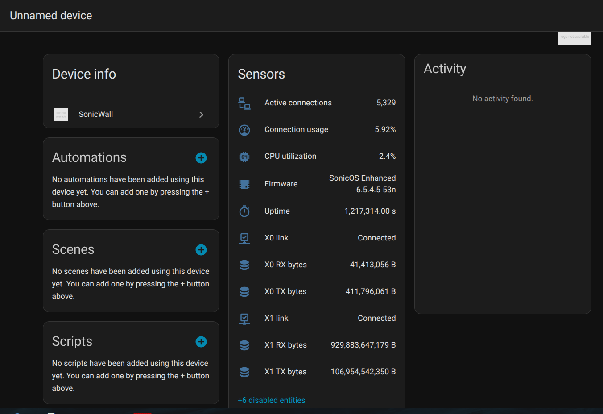
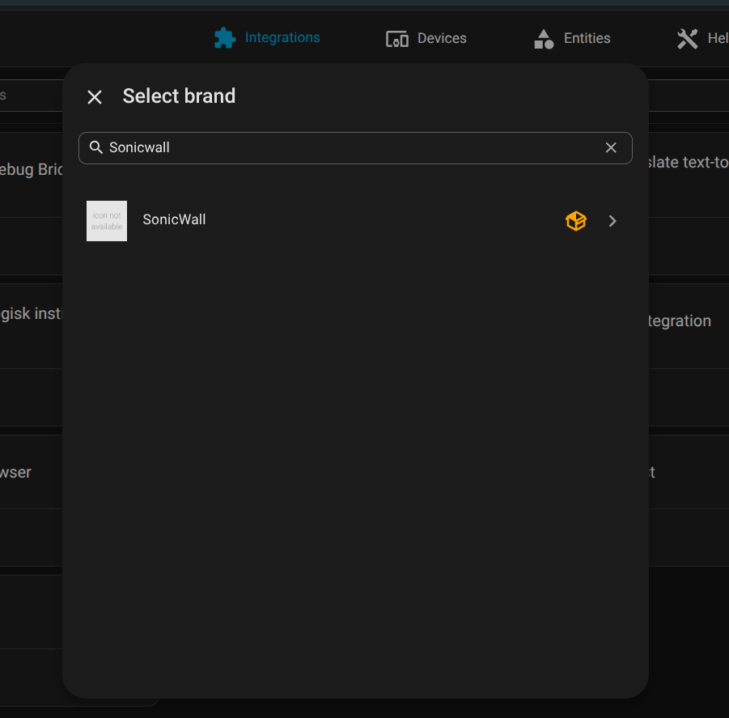
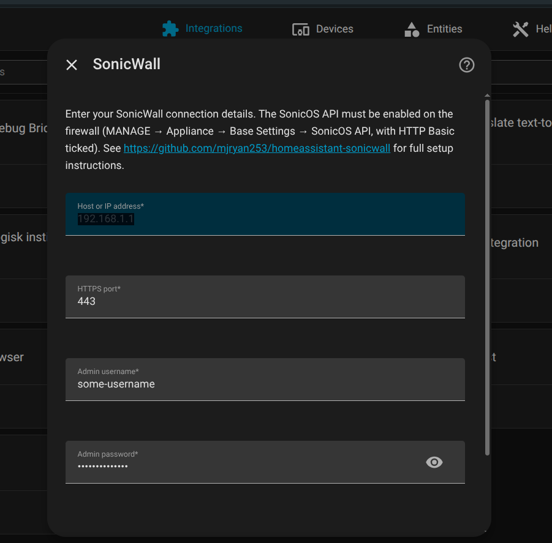

# SonicWall integration for Home Assistant

A Home Assistant custom integration that polls a SonicWall firewall over its built-in SonicOS REST/JSON API (HTTPS) and exposes device-health and per-interface throughput as sensors. **Read-only**, **local polling only** — no cloud service, no outbound traffic, no telemetry. The firewall is contacted directly on its LAN address.

## Compatibility

### Confirmed working

| Component | Version |
|---|---|
| Hardware | SonicWall **TZ350** |
| Firmware | **SonicOS Enhanced 6.5.4.5-53n** |
| Home Assistant | 2026.4.x (Python 3.14, Docker container) |

### Expected to work (untested — feedback welcome)

Any **Gen 6 SonicWall** running **SonicOS 6.5.4.4 or later** with the SonicOS API enabled. Per SonicWall's published OpenAPI catalogue, that covers:

- **TZ-series:** TZ-300, TZ-300P, TZ-300W, TZ-350, TZ-350W, TZ-400, TZ-400W, TZ-500, TZ-500W, TZ-600, TZ-600P
- **NSA-series:** NSA 2600, 2650, 3600, 3650, 4600, 4650, 5600, 5650, 6600, 6650
- **SOHO-series:** SOHO-250, SOHO-250W, SOHOW
- **SuperMassive:** 9200, 9250, 9400, 9450, 9600, 9650

If you run it on any of those, please [open an issue](https://github.com/mjryan253/homeassistant-sonicwall/issues) confirming success — or reporting fixes.

### Not supported

- **SonicOS 7.x and Gen 7 hardware** (TZ-x70 series, NSA 27xx/47xx/67xx, NSsp). Gen 7 uses a different authentication model (Bearer Token) and a different endpoint surface; it would need a separate integration.
- **SonicOS 6.5.4.3 and older.** The SonicOS API didn't exist until 6.5.4.4.
- **Cloud-managed firewalls** where the local API has been disabled.

## What you get

- **5 device sensors:** firmware version, CPU utilisation (%), connection-table usage (%), active firewall connection count, uptime (seconds).
- **2 per-interface byte counters** for every IPv4 interface the firewall reports — typically `X0` through `X4` (so 10 sensors on a TZ350). RX bytes and TX bytes, both `total_increasing` so they integrate cleanly with HA's statistics / utility-meter helpers. Disable the ones you don't care about (unused OPT ports etc.) in the entity registry.
- **Per-interface link binary_sensors** for `X0` and `X1` by default (`connectivity` device class). Edit the `LINK_INTERFACES` tuple in [`binary_sensor.py`](custom_components/sonicwall/binary_sensor.py) to expose more.

> **Not exposed, by limitation of the SonicOS 6.5 API:**
> Live RAM utilisation. `/api/sonicos/reporting/system` returns only the static spec string (`"1 GB RAM, 64 MB Flash"`) on Gen 6 — there's no live memory-usage figure to surface.

## Prerequisites: firewall-side setup

Once-off, in the SonicWall web UI:

1. Switch to the **MANAGE** view (top tab).
2. Go to **Appliance → Base Settings**.
3. In the **SonicOS API** section, tick **Enable SonicOS API** and **Enable RFC-2617 HTTP Basic Access authentication**. Leave the other auth methods unchecked unless you have another reason to enable them.
4. Click **ACCEPT**.
5. **Create a dedicated admin user for Home Assistant** (e.g. `ha-monitor`) with a long, unique password used by nothing else. Add it to the **`SonicWALL Administrators`** group — *not* `Limited Administrators` and *not* `Read-Only Admins`. SonicOS 6.5 rejects both of those at the API with `E_UNAUTHORIZED ("Limited admin access is not currently supported.")` even though they work fine in the GUI. Only full `SonicWALL Administrators` is accepted by the API on Gen 6. Mitigation: this integration only ever issues `GET` requests, so the elevated group membership isn't actively used; isolating it to a dedicated account at least keeps it off your day-to-day admin login.

## Installation

### Via HACS (recommended)

One-click: the badge above opens HACS on your Home Assistant with this repo pre-filled. Otherwise:

1. In HACS, **⋮ menu → Custom repositories**, add `https://github.com/mjryan253/homeassistant-sonicwall` as **Integration**.
2. Search HACS for **SonicWall** and install.
3. Restart Home Assistant.

### Manual

Copy [`custom_components/sonicwall/`](custom_components/sonicwall/) into your HA `config/custom_components/` directory and restart HA.

### Configure

After restart, **Settings → Devices & Services → Add Integration**, then search for **SonicWall**:

Select it and fill the form:

| Field | Value |
|---|---|
| Host or IP address | Your firewall's LAN IP (e.g. `192.168.168.168` for factory default) |
| HTTPS port | `443` unless you've changed it |
| Admin username | The dedicated account you created above |
| Admin password | …its password |
| Verify SSL certificate | **off** unless you've installed a publicly-trusted cert (factory cert is self-signed) |

The integration appears under **Devices** identified by the firewall's serial number — you can re-add the same firewall safely; the duplicate-detection key is the serial, not the host/IP.

## Polling interval

Defaults to 30 seconds. Reasonable for a LAN-local device, gives byte counters useful resolution for HA's `statistics` integration. Edit `DEFAULT_SCAN_INTERVAL_SECONDS` in [`const.py`](custom_components/sonicwall/const.py) if you need tighter or slacker polling.

## Troubleshooting

- **"Unable to connect"** — confirm the SonicOS API toggle is enabled (see prerequisites). Verify reachability from another host on the same network: `curl -ks https://<firewall>/api/sonicos/version`. Should respond with a 401 (no auth) — that's a *good* sign meaning the API is up.
- **"Username/password wrong" / `E_UNAUTHORIZED`** — by far the most common cause is the user account not being a member of `SonicWALL Administrators`. Read-Only Admins and Limited Administrators don't work at the API even though they work in the GUI. Add the account to `SonicWALL Administrators` and log out any active GUI session for that user before retrying.
- **"Failed setup, will retry"** in the integration card — open the HA log (Settings → System → Logs) and search for `sonicwall`. The traceback will pinpoint the failure. Common causes: SonicOS max-admin-sessions limit reached (clear stale sessions in MANAGE → System → Administration → Multiple Administrators → Active Administrator List), or the firewall reachable but a parser miss on a sensor (the integration setup itself succeeds; only the affected sensor goes `unavailable`).
- **HA log shows `SSLCertVerificationError`** — turn off "Verify SSL certificate" in the integration's config. The TZ-series factory cert is self-signed.
- **One sensor reports `unknown`** — usually a parser-versus-firmware-string mismatch. Capture the raw response with `curl -ksv https://<firewall>/api/sonicos/reporting/system` (after a `POST /auth`) and [open an issue](https://github.com/mjryan253/homeassistant-sonicwall/issues) with the firmware version, redacted output, and the affected sensor name.

## How it talks to the firewall (technical notes)

A few non-obvious behaviours of the SonicOS 6.5 API that this integration handles. Mostly here for anyone debugging or extending the code.

- **Source-IP-bound sessions, not cookies.** Despite what curl's `-c`/`-b` flags suggest, the firewall does *not* return a `Set-Cookie` header on `POST /api/sonicos/auth`. After a successful authentication it accepts subsequent requests from the same client IP within the idle window. The integration POSTs `/auth` once on setup and tracks login state with a single boolean — no cookie parsing, no cookie jar interaction. Re-login + retry-once is wired into [`api.py`'s `_authenticated_get`](custom_components/sonicwall/api.py) for when the firewall's idle timeout fires between coordinator polls.
- **HTTP/1.0 with no `Content-Length`.** SonicOS replies with HTTP/1.0 and uses connection-close to delimit response bodies. aiohttp's `response.content_length` is therefore `None` on every response — the client must call `response.json()` and let aiohttp read until EOF, not rely on the length header.
- **Human-string fields, not raw numbers.** `/reporting/system` returns CPU as `"6.35% - 2 x 1200 MHz Mips64 Octeon Processor"`, uptime as `"13 Days 10:56:12"`, and current connections as `"Peak: 6843 Current: 5433 Max Allowed: 90000 Max: 90000"`. The sensors parse the relevant numbers with small regex helpers in [`sensor.py`](custom_components/sonicwall/sensor.py). A parse miss returns `None`, which leaves the entity `unavailable` rather than crashing the coordinator.
- **Endpoints used.** Coordinator polls four GETs concurrently per cycle: `/version`, `/reporting/system`, `/reporting/interfaces/ipv4`, `/reporting/interfaces/ip`. The firewall handles them in well under a second.
- **Single concurrent admin session class.** Only members of `SonicWALL Administrators` can authenticate at the API. The 6.5 firmware explicitly rejects Limited / Read-Only admins with `"Limited admin access is not currently supported."` — a SonicWall design constraint, not an integration choice.
- **Self-signed certificate.** TZ-series ships with a self-signed HTTPS cert. The `Verify SSL certificate` config-flow toggle should be off unless you've installed a publicly-trusted cert.

## Development

This repo started life as a fork of [`ludeeus/integration_blueprint`](https://github.com/ludeeus/integration_blueprint); the standard blueprint dev workflow applies:

- `scripts/setup` — install Python deps for development.
- `scripts/develop` — boot a local Home Assistant instance from `./config/` with this integration loaded.
- `scripts/lint` — run `ruff check` + `ruff format`.

The recommended dev environment is the included [`.devcontainer.json`](.devcontainer.json) (Python 3.14 + Home Assistant 2026.3.x + ruff 0.15.x).

PRs welcome — particularly: confirmation reports for other Gen 6 hardware, additional parsers for fields the integration doesn't currently expose, and a Gen 7 (`SonicOS 7.x`) sibling integration.

## License

[MIT](LICENSE).
